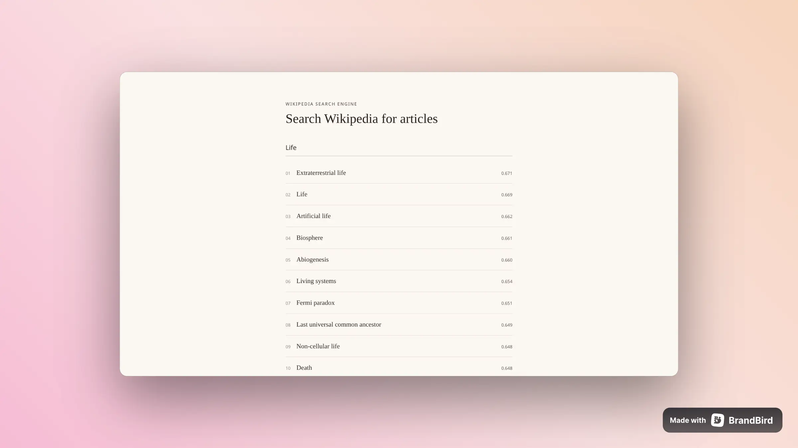
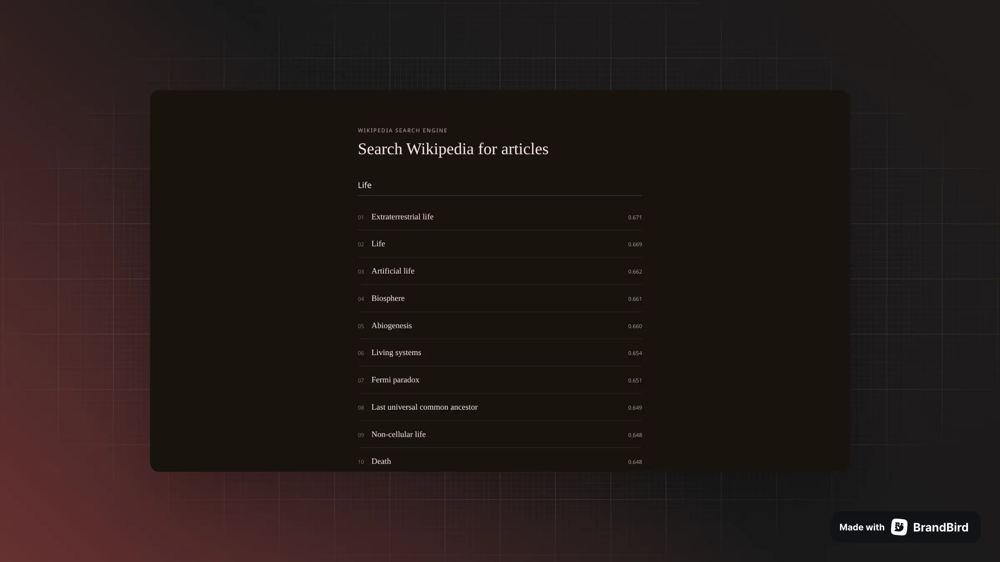

# The Index

A Wikipedia search engine built from scratch. A crawler pulls pages into SQLite, a BM25 scorer ranks them against a query, and a small Express app serves both a JSON API and a search page.

Built with undici and cheerio for crawling, Express and Pug for the server and page, better-sqlite3 for storage.

<div>
  
  
</div>

## How it works

1. **Crawl** (`src/features/crawler`): starting from one seed article, a script fetches the page, pulls the title and paragraph text (skipping "See also," "References," and "External links"), and follows its links to queue up more pages. It skips anything that isn't a real article, like Talk or Category pages. Each article gets upserted into a SQLite table (`src/db`), keyed by title.
2. **Index** (`src/features/search`): every article gets tokenized (lowercased, punctuation stripped, stop words dropped) into an inverted index: for each word, which articles contain it and how many times. This build gets cached to `index-cache.json`, so the server loads it straight from disk on the next boot instead of re-tokenizing the whole corpus. The crawler rebuilds the cache after each run; if you edit the database by hand, you'll need to rerun the crawler to pick it up.
3. **Search** (`src/routes`): a query runs through the same tokenizer, then gets scored against every article that shares a term, using BM25. Rare words count for more than common ones, and score is normalized against article length so long articles don't win just by being long.
4. **Read**: results link straight out to the Wikipedia article. There's no in-app article view.

## Project layout

```
src/
  app.ts                  # express app: middleware, routers, view engine
  index.ts                # entrypoint, starts the server
  db/                      # sqlite connection and document queries
  features/
    crawler/               # crawls Wikipedia into the db, rebuilds the index cache
    search/
      utils/                # tokenize, indexing, scoring, search, index cache
      corpus.ts              # loads documents + index at boot
      index.ts                # CLI for querying the index directly
  routes/                  # health check, JSON search API, HTML search page
  templates/                # pug views for the search page
  public/                    # static CSS
```

## Running it

```
npm install
cp .env.example .env
npm run dev
```

Runs on the port set in `.env` (`3000` by default).

To (re)build the document corpus and index cache:

```
npx tsx src/features/crawler/index.ts
```

Edit `SEED_URL` and `PAGE_LIMIT` at the top of that file to crawl a different starting point or a different number of pages.

There's also a CLI for querying the index directly, without starting the server:

```
npx tsx src/features/search/index.ts "your query here"
```

To build and run the compiled version:

```
npm run build
npm start
```

## API

| Method | Path             | Description                               |
| ------ | ---------------- | ----------------------------------------- |
| GET    | `/api/health`    | Health check                              |
| GET    | `/api/search?q=` | Search results as JSON, ranked best first |

The search page itself (`/`) is server-rendered with Pug; typing in the input hits `/search/results?q=` and swaps in just the results fragment, no full page reload.

## Limitations

The index lives in `index-cache.json` on disk, but it's a snapshot: nothing keeps it in sync with the database automatically. Add articles outside the crawler and they won't show up in search until you rebuild the cache.

## Attribution

Article content is crawled from [Wikipedia](https://www.wikipedia.org) and used under the [CC BY-SA 4.0](https://creativecommons.org/licenses/by-sa/4.0/) license.
